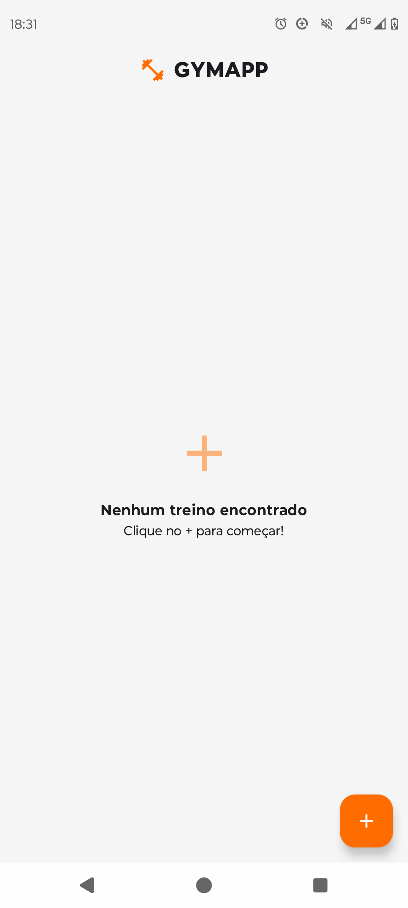
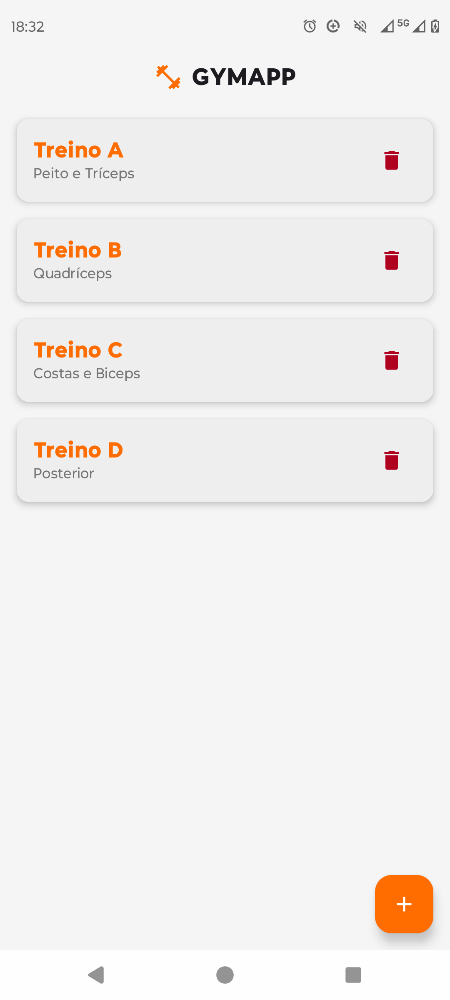
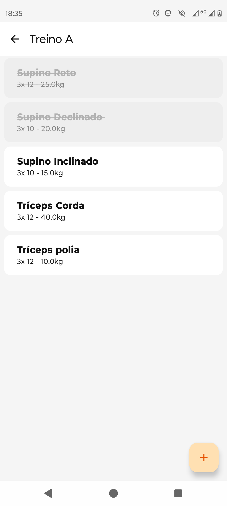
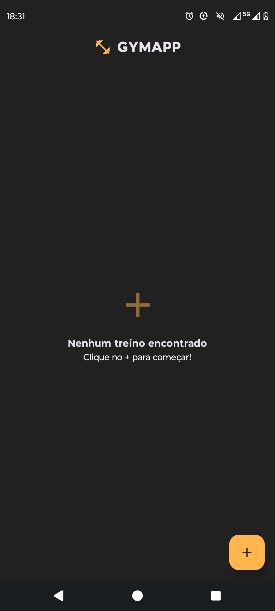
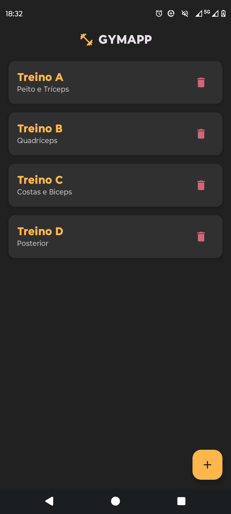
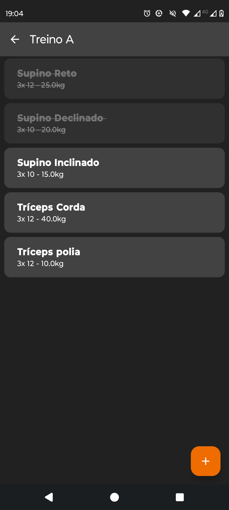

# 🏋️‍♂️ GymApp


Um aplicativo moderno e responsivo para gerenciamento de treinos de academia, construído 100% com as ferramentas mais recentes do ecossistema Android (Modern Android Development - MAD).

O GymApp permite que os usuários criem rotinas personalizadas, adicionem exercícios com controle de séries, repetições e cargas, e acompanhem o progresso de forma visual e intuitiva.

<p align="center">
    
    
    
    <br>
    
    
    
</p>

## ✨ Funcionalidades (UX/UI)

* **Gestão de Treinos (CRUD):** Criação, listagem e exclusão de treinos personalizados.
* **Controle de Exercícios:** Adição de exercícios detalhados (Nome, Séries, Repetições e Carga).
* **Feedback Tátil e Visual:** Interação de "Check" para marcar exercícios concluídos e *Swipe-to-Dismiss* (deslizar para o lado) para deletar, com animações nativas.
* **Prevenção de Erros:** Diálogos de confirmação antes de ações destrutivas (excluir treino inteiro).
* **Design Responsivo & Temas:** Suporte nativo e fluido aos modos Claro e Escuro (Light/Dark Mode), utilizando uma paleta de cores personalizada de alto contraste projetada para ambientes de academia.
* **Empty States:** Telas amigáveis quando não há dados, melhorando a jornada do usuário.

## 🛠️ Arquitetura e Tecnologias

Este projeto foi desenvolvido focando em escalabilidade, manutenção e testes, seguindo os princípios da **Clean Architecture** e o padrão **MVVM (Model-View-ViewModel)**.

* **Linguagem:** Kotlin
* **Interface (UI):** Jetpack Compose (Single-Activity Architecture)
* **Navegação:** Jetpack Navigation Compose
* **Injeção de Dependência:** Dagger Hilt
* **Banco de Dados Local:** Room Database
* **Assincronismo & Reatividade:** Kotlin Coroutines e Kotlin Flows (StateFlow)

## 🏗️ Estrutura do Projeto

A organização dos pacotes reflete a separação de responsabilidades:
- `data/local`: Entidades do banco de dados, DAOs e o Database do Room.
- `repository`: Repositórios para abstrair a fonte de dados (Single Source of Truth).
- `di`: Módulos de injeção de dependência do Hilt.
- `ui/screens`: Composables representando as telas do aplicativo.
- `ui/viewmodel`: Gerenciamento de estado e regras de negócio da UI.
- `ui/theme`: Configurações globais de tipografia, paleta de cores (Gym Pro) e tema Material 3.

## 🚀 Como executar o projeto

1. Clone este repositório:
   ```bash
   git clone https://github.com/IagoRochaDev/GymApp-Android.git
2. Abra o projeto no Android Studio (versão Iguana ou superior recomendada).

3. Aguarde o Gradle sincronizar as dependências.

4. Execute o projeto em um emulador ou dispositivo físico (Android 8.0+).

## 🔮 Próximos Passos (Backlog)

- [ ] Implementar cronômetro de descanso entre as séries.

- [ ] Criar gráficos de progressão de carga ao longo das semanas.

- [ ] Exportar/Compartilhar rotina de treinos via WhatsApp.

---

---

<p align="center">
  Feito com ☕ + 💻 por 
  <a href="https://github.com/IagoRochaDev">
    <strong>Iago Rocha Oliveira</strong>
  </a>
</p>